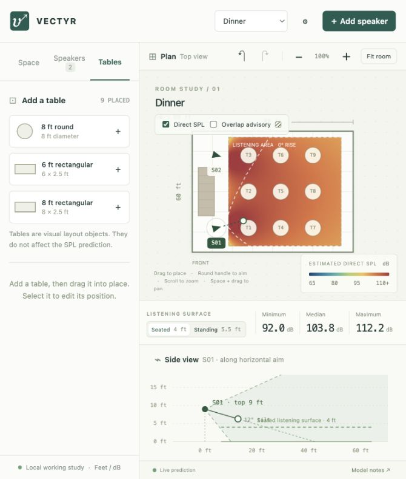

# Vectyr Wyrx

An interactive first slice for laying out a rectangular AV space and exploring simplified speaker coverage. Built to try the interface before defining the next slice.



The **Tables** view with the **Dinner** starting layout. Tables are visual layout objects and do not affect the SPL prediction.

## Run

With Node.js 22 or newer:

```sh
npm start
```

Open [the local app](http://127.0.0.1:5173). No dependency installation is needed. The server binds only to the local computer. Stop it with Ctrl+C.

## Try it

- Change room dimensions in **Space**, then press Enter or Tab. Stage and seating footprints can be dragged, resized with their corner handle, or edited numerically.
- Enter a **10 × 14 ft** stage to see the **Custom** designation.
- Drag a speaker in the plan; drag its round handle to aim horizontally. In the side view, drag the source up/down or its round handle to adjust vertical aim.
- Adjust seating rise, or switch between **Seated / 4 ft** and **Standing / 5.5 ft**.
- Edit a speaker's HF beamwidths, peak SPL at 1 metre, and output offset. Mute or duplicate individual speakers.
- Enable **Overlap advisory** to see the agreed overlap screening rule.
- Add tables, or choose a **Conference**, **Concert**, or **Dinner** starting layout. Presets replace the working layout; Undo restores the previous one.
- Hover over the listening area for a point SPL readout. Zoom with the wheel and pan with Space + drag; **Fit room** restores the view.
- Use **Settings** to change the default output offset for new speakers and the fixed legend range.
- Undo/redo with the toolbar or Cmd/Ctrl+Z / Cmd/Ctrl+Shift+Z.

**The study and settings are held in memory. Reloading resets them.** Save/load and CAD export are future work.

## Model and verification

This is a generic direct-sound planning model, not a manufacturer-calibrated acoustic prediction. **Model notes** in the app describes the assumptions. The cabinet top is provisionally used as the acoustic source; reflections and phase/delay interactions are excluded.

```sh
npm run check
npm test
```

The focused model checks cover reference levels, distance loss, HF beamwidths, aiming, energy summation, the overlap rule, listener height, furniture neutrality, custom stages, and the side-view intersection.

See [first-slice notes](docs/first-slice.md), [the scope record](docs/proof-of-concept.md), and [the glossary](CONTEXT.md).
